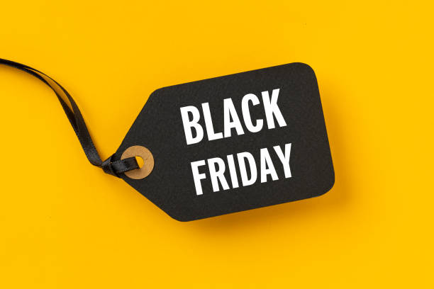

 

# Black-Friday-EDA

Black Friday is an important time for shops hoping to make record sales. Although in-store sales are becoming less popular, online sales are growing due to the ease of obtaining a product. Therefore, it is important for shops to understand the needs of consumers.

This project consists of analysing purchasing trends, identifying consumers to target in order to increase purchases.
